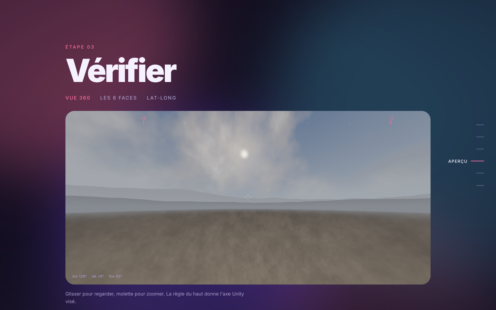
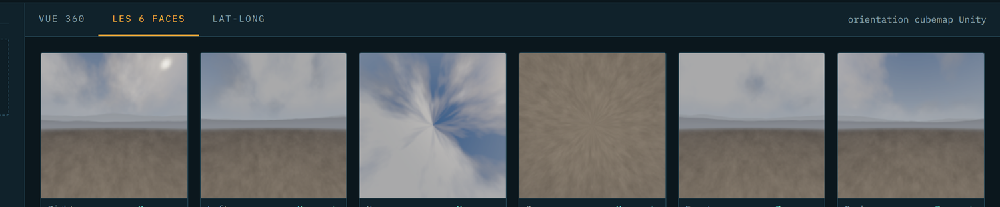
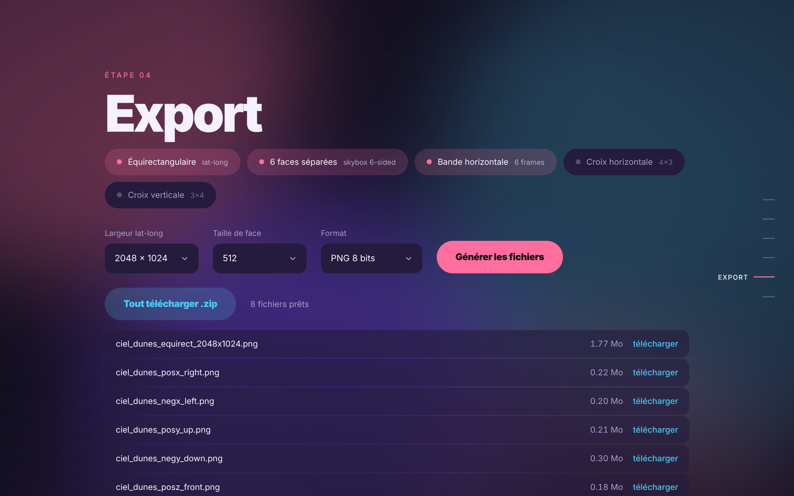
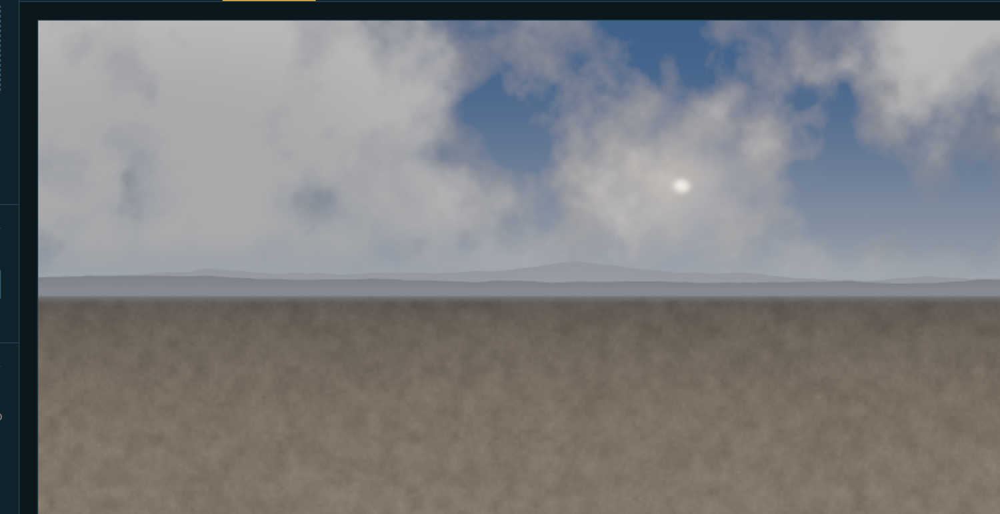

<div align="center">

# PROBE

**Convertisseur de textures vers environnements 360 prêts pour Unity**

Page HTML autonome · rendu WebGL2 · rien ne quitte la machine

<sub>`lat-long` · `cubemap` · `croix 4×3 / 3×4` · `bande 6 frames` · `angular map` · `boule miroir` · `fisheye 180°` · `Radiance .hdr`</sub>



</div>

---

## Démarrer

Ouvrir `probe-360.html` dans un navigateur récent. Aucune installation, aucun build, aucun serveur.

1. **Déposer une image.** Le format est déduit du ratio.
2. **Vérifier l'orientation** dans la vue 360 — la boussole affiche l'axe Unity visé.
3. **Corriger** avec la rotation Y ou les miroirs si un repère connu ne tombe pas au bon endroit.
4. **Cocher les sorties**, choisir les résolutions, générer.

La seule dépendance externe est JSZip, chargée depuis un CDN au moment de cliquer sur *Tout télécharger (.zip)*. Hors ligne, les téléchargements fichier par fichier fonctionnent quand même.

<br>

## Entrées reconnues

Détection automatique par ratio, forçable à tout moment dans le menu déroulant.

| Format | Ratio | Notes |
| :--- | :---: | :--- |
| Équirectangulaire (lat-long) | `2:1` | le cas courant — HDRI de banque d'images |
| Croix horizontale | `4:3` | cubemap déplié |
| Croix verticale | `3:4` | le `−Z` est lu tourné à 180° |
| Bande horizontale | `6:1` | ordre `+X −X +Y −Y +Z −Z` |
| Bande verticale | `1:6` | même ordre, de haut en bas |
| Angular map / light probe | — | centre `+Z`, bord du cercle `−Z` |
| Boule miroir | — | ball photographiée depuis `−Z` |
| Fisheye 180° | — | dôme au zénith, hémisphère inférieur miroité |
| Texture plate, étirée | *tout* | l'image est tendue sur la sphère entière |
| Texture plate, en tuiles | *tout* | répétition réglable, miroir optionnel |

Fichiers acceptés : **PNG · JPG · WebP · Radiance `.hdr`** (RLE et non compressé). Un `.hdr` est décodé en flottant et reste linéaire d'un bout à l'autre de la chaîne.

<br>

## Sorties



| Sortie | Détail |
| :--- | :--- |
| **Équirectangulaire** | 1024 → 8192 px de large, ratio 2:1 |
| **6 faces séparées** | `posx_right` `negx_left` `posy_up` `negy_down` `posz_front` `negz_back` |
| **Bande horizontale** | la disposition *6 Frames Layout* de Unity |
| **Croix horizontale 4×3** | avec les cellules vides en noir |
| **Croix verticale 3×4** | le `−Z` est écrit tourné à 180°, comme Unity l'attend |

Formats : **PNG 8 bits**, **JPEG q92**, ou **Radiance `.hdr`**. La sortie `.hdr` n'est proposée que depuis une source `.hdr`, exige `EXT_color_buffer_float`, et est plafonnée à 4096 px de large côté lat-long — au-delà, la lecture GPU dépasse le gigaoctet.



<br>

## Conventions

Tout est exprimé dans le repère de Unity : **main gauche**, `X` à droite, `Y` en haut, `Z` en avant.

#### Lat-long



Le centre horizontal de l'image correspond à `+X`, le haut à `+Y`, et la longitude augmente vers `−Z`. C'est exactement ce que fait le shader `Skybox/Panoramic` de Unity :

```glsl
u = 0.5 − atan2(d.z, d.x) / 2π
v = 1.0 − acos(d.y) / π
```

La plupart des HDRI de banque d'images placent leur centre ailleurs. Le slider **Rotation autour de Y** est là pour ça.

#### Cubemap

Faces D3D/Unity, avec `u` vers la droite de l'image et `v` vers le haut :

```
+X → ( 1,  v, −u)        +Y → ( u,  1, −v)        +Z → ( u,  v,  1)
−X → (−1,  v,  u)        −Y → ( u, −1,  v)        −Z → (−u,  v, −1)
```

Ces mêmes fichiers conviennent à un asset Cubemap **et** à un matériau `Skybox/6 Sided` — les deux partagent cette orientation.

#### Vérifier avant d'exporter

La boussole de la vue 360 affiche `+Z / +X / −Z / −X` au fil de la rotation, avec la lecture `lon / lat / fov` en bas à gauche. Si un repère connu de la source ne tombe pas sur le bon axe, corriger **avant** l'export, pas après.

<br>

## Import dans Unity

**Lat-long en cubemap**
`Texture Shape → Cube`, `Mapping → Latitude-Longitude Layout (Cylindrical)`.
`Convolution Type: None` pour un skybox, `Specular` pour une réflexion.

**Bande ou croix en cubemap**
`Texture Shape → Cube`, `Mapping → 6 Frames Layout (Cubic Environment)`.

**6 faces séparées**
Matériau `Skybox/6 Sided` :

| Slot | Fichier | Axe |
| :--- | :--- | :---: |
| `_RightTex` | `…_posx_right` | `+X` |
| `_LeftTex`  | `…_negx_left`  | `−X` |
| `_UpTex`    | `…_posy_up`    | `+Y` |
| `_DownTex`  | `…_negy_down`  | `−Y` |
| `_FrontTex` | `…_posz_front` | `+Z` |
| `_BackTex`  | `…_negz_back`  | `−Z` |

Passer les six en `Wrap Mode: Clamp`, sinon des lignes apparaissent aux arêtes du cube.

**Fichiers `.hdr`**
Importés nativement. Activer `High Dynamic Range`, laisser la compression en `BC6H` pour une réflexion ou une lightmap.

**Éclairage**
`Window → Rendering → Lighting → Environment → Skybox Material`, puis `Generate Lighting` pour que l'ambiante suive la nouvelle sphère.

<br>

## Sous le capot

Un seul contexte WebGL2 et un seul fragment shader font tout le travail. Le shader calcule une direction monde à partir du pixel de sortie — lat-long, face de cube, ou rayon caméra pour l'aperçu — applique l'orientation, puis échantillonne la source selon son interprétation. Les exports passent par des framebuffers hors écran : `RGBA8` pour le 8 bits, `RGBA32F` pour le `.hdr`.

Deux précautions contre les artefacts de filtrage :

- **La couture au méridien ±180°** d'une lat-long casse les dérivées d'écran et produit une ligne floue. Le shader calcule les dérivées sur deux paramétrisations décalées d'un demi-tour et garde la plus petite.
- **Les sources en croix ou en bande** voient leurs dérivées calculées dans l'espace local de la face, ce qui garde le mip correct partout sauf sur la ligne d'arête.

Les mipmaps de la source sont générées quand le pilote l'accepte, ce qui évite l'aliasing quand une grande texture est réduite vers une petite face.

<br>

## Limites connues

- L'export `.hdr` n'écrit pas de compression RLE : les fichiers sont plus gros que ceux d'un outil dédié, mais parfaitement lisibles.
- Les `.hdr` dont l'en-tête déclare une orientation autre que `-Y … +X …` sont refusés.
- Pas de lecture `.exr` — le décodage OpenEXR demanderait une dépendance externe.
- Le point de silhouette d'une boule miroir n'a aucune information exploitable : une source de ce type laisse toujours une zone dégénérée derrière la caméra.
- Une sortie 8192×4096 en PNG demande environ 500 Mo de mémoire pendant l'encodage. Sur une machine juste, rester à 4096.

<br>

<div align="center">
<sub>Les captures montrent un panorama de test généré procéduralement.</sub>
</div>
